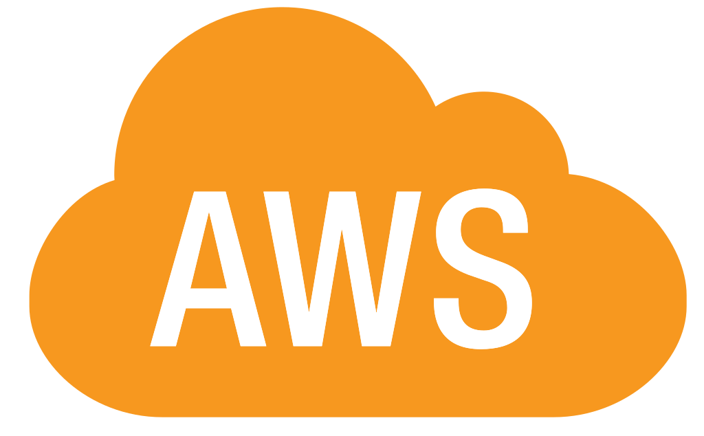

#  GoHelpMe 


_GoHelpMe_ is a full stack web application that connects users interested in volunteering with those who are trying to organize events.

**Note:** It is recommended you run GoHelpMe either on Chrome or Firefox. Running this web app on Safari is undefined behavior.

## Table of Contents
- [Features](https://github.com/fahimWad/GoHelpMe/#features)
- [Technologies](https://github.com/fahimWad/GoHelpMe/#technologies)
- [Setup](https://github.com/fahimWad/GoHelpMe/#setup)
- [Authors](https://github.com/fahimWad/GoHelpMe/#authors)

## Features

- **Sign-up for Events**: From our homepage, users will able to sign-up for events that they would like to volunteer at.
- **Track Volunteer Hours**: Using our Hour Tracker, users can make a portfolio of their volunteering experiences so they can reference it for later.
- **Sort Volunteer Experiences**: In addition to tracking their experiences, users can easily sort the portfolio based on event name, date, hours, role, and organizer name for easier lookup.

> We also added some additional features as well:
> - Event organizers can access a list of their registered volunteers’ information (name and email)
> - Ability to track all the events you have created
> - Ability to track all all the events you have signed up to volunteer for

## Technologies
- React.js 
- Django 
- PostgreSQL  (hosted on AWS )

## Setup
In order to run a local instance of GoHelpMe, follow the instructions below.

<details><summary><b>Show instructions</b></summary>

1. Create a new directory and startup a virtual environment

```shell
mkdir webapp
cd webapp
python3 -m venv venv
source venv/bin/activate
```

2. Clone this repository and change into its directory

```shell
git clone https://github.com/fahimWad/GoHelpMe.git
```

3. Install dependencies for the back end

```shell
pip install -r GoHelpMe/backend/requirements.txt
pip install --upgrade pip
```

4. Download `.env` file (emailed to you) into the `webapp/GoHelpMe/backend/GoHelpMe` directory
  
5. Make migrations for back end
```shell
python GoHelpMe/backend/manage.py makemigrations
python GoHelpMe/backend/manage.py migrate
```

6. Run the backend server
```shell
python GoHelpMe/backend/manage.py runserver
```

7. In a separate terminal, install the frontend dependencies
```shell
cd webapp
source venv/bin/activate
cd GoHelpMe/frontend
npm -f install
```

8. Run the webapp!
```shell
npm start
```

9. Go to http://127.0.0.1:3000/ in a browser to view the project

</details>

## Authors
_GoHelpMe_ was made as a project for **CS 35L** taught by Professor Paul Eggert at UCLA in Spring 2024. 

**Made by**: Marc Luzuriaga (Mjluzuriaga109@gmail.com), Claire Li (clairemcli@ucla.edu), Avinash Swain (aviswain1@gmail.com), Evelyn Cho (yehyeoncho@gmail.com), Fahim Wadhwania (fwadhwania@ucla.edu), & Palak Parikh (palak.parikh29@gmail.com).

